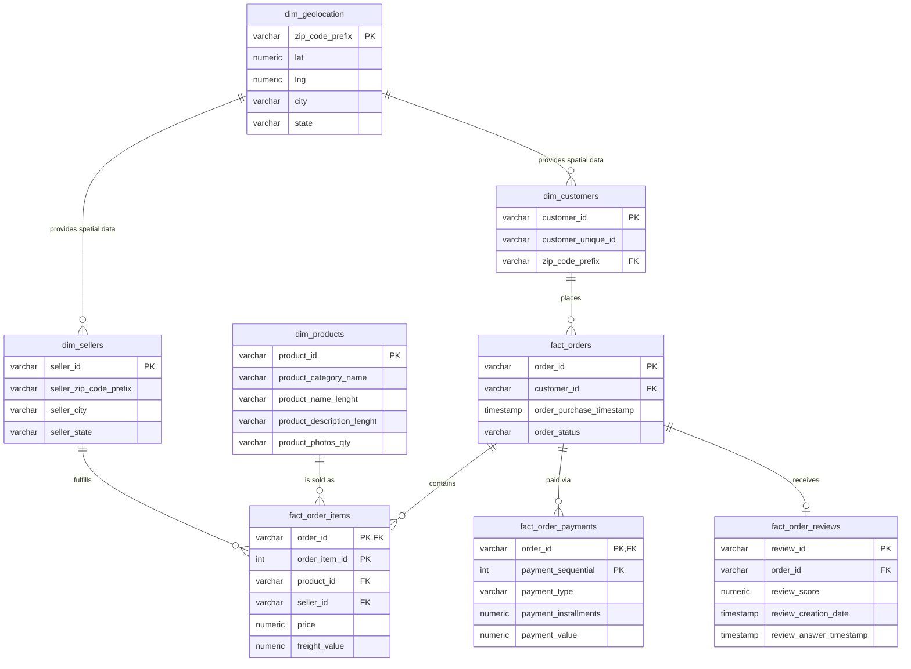

# Brazilian E-Commerce Analytics & Relational Database Pipeline

## 📌 Project Overview

This project analyzes the Olist Brazilian E-Commerce Dataset, which contains approximately 100,000 orders from 2016 to 2018. The goal is to build a complete end-to-end data pipeline that covers raw data ingestion, transformation, and analytics-ready schema design.

The repository demonstrates how raw transactional e-commerce data can be transformed into a structured, reliable, and analytics-ready relational database using SQL best practices. It focuses on:

- Data ingestion from raw CSV files
- Data cleaning and validation
- 3NF relational database design
- Business intelligence queries
- SQL performance optimization
- Analytical exploration of e-commerce trends

This project is designed to showcase strong SQL, database modeling, and data engineering fundamentals for recruiters and hiring managers.

---

## 🛠️ Tech Stack

| Component | Technology |
|-----------|-----------|
| Database | PostgreSQL / SQL-compatible RDBMS |
| Data Format | CSV files |
| Query Language | SQL |
| Data Modeling | 3NF Normalization |
| Analytics | CTEs, Window Functions, Aggregations |
| Optimization | Indexing, Query Tuning, EXPLAIN ANALYZE |
| Tools | Git, SQL Editor, DB Client |
| Data Source | Olist Brazilian E-Commerce Dataset |

---

## ✨ Key Features

- End-to-end SQL data pipeline from raw data to analytics-ready schema
- Structured 3NF database design for referential integrity
- Staging layer for raw ingestion
- Data cleaning and deduplication logic
- Business-focused analytical queries
- Advanced SQL techniques like:
  - Common Table Expressions (CTEs)
  - Window functions
  - Recursive queries
  - Aggregate analysis
- Performance-oriented SQL practices and optimization

---

## 🗄️ Database Architecture (3NF Schema)

The raw dataset was normalized into a Third Normal Form (3NF) relational schema to reduce data redundancy, ensure referential integrity, and support meaningful analytics.



### Schema Design Highlights

- Customers and sellers are separated into dimension tables
- Products are stored independently for reusability
- Orders remain the central transaction fact table
- Order items, payments, and reviews are linked to order-level facts
- Geography data is centralized in `dim_geolocation`
- The schema is normalized to reduce duplicate information and support clean analytical querying

---

## 📁 Project Structure

```text
E-Commerce-Analytics/
├── Data/                              # Raw data files (ignored in git)
├── docs/
│   └── data_quality_report.md         # Profiling and quality analysis
├── SQL_Scripts/
│   ├── 01_DDL_and_Data_Load.sql       # Creates staging tables and loads raw data
│   ├── 02_Data_Cleaning_and_Load.sql  # Cleans and normalizes data into 3NF tables
│   ├── 03_Subqueries_and_CTEs.sql     # Advanced analytical SQL
│   ├── 04_Window_Functions.sql        # Window-based business analytics
│   └── 05_Optimization.sql            # Indexes, tuning, performance analysis
├── .gitignore
├── README.md
└── LICENSE
```

---

## 🚀 Getting Started

### Prerequisites

- PostgreSQL (v12 or higher) installed and running
- SQL client such as pgAdmin, DBeaver, or psql CLI
- Git installed
- Kaggle account to download the dataset
- Python (optional, for Kaggle API automation)

### Step 1: Download the Raw Dataset from Kaggle

#### Option A: Manual Download from the Kaggle Website

1. Create a Kaggle account if you do not already have one.
2. Go to the Olist dataset page:
   https://www.kaggle.com/datasets/olistbr/brazilian-ecommerce
3. Click the Download button and accept the dataset terms if prompted.
4. Extract the downloaded ZIP file to your local machine.
5. Save the extracted CSVs in a folder such as:

```bash
E-Commerce-Analytics/
└── Data/
    ├── olist_customers_dataset.csv
    ├── olist_sellers_dataset.csv
    ├── olist_products_dataset.csv
    ├── olist_orders_dataset.csv
    ├── olist_order_items_dataset.csv
    ├── olist_order_payments_dataset.csv
    ├── olist_order_reviews_dataset.csv
    ├── olist_geolocation_dataset.csv
    └── product_category_name_translation.csv
```

#### Option B: Download via Kaggle API

1. Install the Kaggle package:

```bash
pip install kaggle
```

2. Create a Kaggle API token:
   - Sign in to Kaggle
   - Go to Account > Create New API Token
   - Download the `kaggle.json` file

3. Place the file in the correct location:

```bash
mkdir -p ~/.kaggle
mv ~/Downloads/kaggle.json ~/.kaggle/kaggle.json
chmod 600 ~/.kaggle/kaggle.json
```

4. Download and unzip the dataset:

```bash
kaggle datasets download -d olistbr/brazilian-ecommerce
unzip brazilian-ecommerce.zip -d ./Data/
```

> **Important:** Make sure all CSV files are extracted into the `Data/` folder before proceeding to the next steps. Verify the folder structure matches the layout above.

### Step 2: Clone the Repository

```bash
git clone https://github.com/your-username/E-Commerce-Analytics.git
cd E-Commerce-Analytics
```

### Step 3: Create the Database in PostgreSQL

Open psql or pgAdmin and create the database:

```sql
CREATE DATABASE ecommerce_analytics;
\c ecommerce_analytics
```

If you are using the terminal, this is also valid:

```bash
psql -U postgres -d postgres -c "CREATE DATABASE ecommerce_analytics;"
```

### Step 4: Run the Two Core Pipeline Scripts

After ensuring all CSV files are in the `Data/` folder and the database is created, execute the two main transformation scripts in order:

#### Script 1: Create Staging Tables and Load Raw Data

Run the first script to create staging tables and load all raw CSV files into PostgreSQL:

```bash
psql -U postgres -d ecommerce_analytics -f SQL_Scripts/01_DDL_and_Data_Load.sql
```

Or inside psql:

```sql
\c ecommerce_analytics
\i SQL_Scripts/01_DDL_and_Data_Load.sql
```

This script performs:
- Creates staging tables with raw column structures matching the Kaggle CSV files
- Loads each CSV file into PostgreSQL staging tables
- Verifies data availability for transformation

After successful completion, you should see output showing row counts for each imported raw table.

#### Script 2: Clean, Deduplicate, and Populate the 3NF Schema

Run the second script to clean the data and populate the normalized 3NF schema:

```bash
psql -U postgres -d ecommerce_analytics -f SQL_Scripts/02_Data_Cleaning_and_Load.sql
```

Or inside psql:

```sql
\i SQL_Scripts/02_Data_Cleaning_and_Load.sql
```

This script performs:
- Data validation and quality checks
- Deduplication logic
- Transformation of staging data into normalized 3NF tables
- Population of dimension and fact tables
- Referential integrity enforcement

### Step 5: Run the Additional Analytics Scripts (Optional)

After the core pipeline is complete, you can explore advanced SQL techniques with the remaining scripts:

```sql
-- 3. Run analytical queries using subqueries and CTEs
\i SQL_Scripts/03_Subqueries_and_CTEs.sql

-- 4. Explore window functions and business analytics
\i SQL_Scripts/04_Window_Functions.sql

-- 5. Performance optimization and indexing
\i SQL_Scripts/05_Optimization.sql
```

You can also run them through the command line:

```bash
psql -U postgres -d ecommerce_analytics -f SQL_Scripts/03_Subqueries_and_CTEs.sql
psql -U postgres -d ecommerce_analytics -f SQL_Scripts/04_Window_Functions.sql
psql -U postgres -d ecommerce_analytics -f SQL_Scripts/05_Optimization.sql
```

### Step 6: Validate the Result

Check that the final tables were created:

```sql
SELECT table_name
FROM information_schema.tables
WHERE table_schema = 'public'
ORDER BY table_name;
```

Example validation query:

```sql
SELECT COUNT(*) AS total_customers FROM dim_customers;
SELECT COUNT(*) AS total_orders FROM fact_orders;
SELECT COUNT(*) AS total_order_items FROM fact_order_items;
```

---

## 📊 Example Business Queries

### 1. Top 10 Sellers by Revenue

```sql
SELECT
    seller_id,
    ROUND(SUM(price), 2) AS total_revenue
FROM fact_order_items
GROUP BY seller_id
ORDER BY total_revenue DESC
LIMIT 10;
```

### 2. Monthly Order Trends

```sql
SELECT
    DATE_TRUNC('month', order_purchase_timestamp) AS order_month,
    COUNT(*) AS total_orders
FROM fact_orders
GROUP BY DATE_TRUNC('month', order_purchase_timestamp)
ORDER BY order_month;
```

### 3. Payment Method Distribution

```sql
SELECT
    payment_type,
    COUNT(*) AS total_transactions,
    ROUND(SUM(payment_value), 2) AS total_amount
FROM fact_order_payments
GROUP BY payment_type
ORDER BY total_amount DESC;
```

### 4. Review Score Analysis

```sql
SELECT
    review_score,
    COUNT(*) AS total_reviews
FROM fact_order_reviews
GROUP BY review_score
ORDER BY review_score;
```

These queries are examples of the kind of analytical questions this project is built to answer.

---

## ✅ Data Quality & Validation

Data quality is a major focus of this project. The pipeline includes checks for:

- Missing values
- Duplicate records
- Invalid dates
- Null foreign keys
- Inconsistent product and customer fields
- Referencing issues across staging and final tables

The report in `docs/data_quality_report.md` summarizes the profiling and validation outcomes.

---

## 🎯 Why This Project Matters

This project demonstrates practical, job-relevant database skills:

- Database design and normalization
- ETL workflow thinking
- Data quality assurance
- Business insight generation
- SQL query optimization
- Analytical problem solving

It is a strong project for showcasing data engineering and analytics capability in a recruiter-friendly manner.

---

## 📄 License

This project is available for educational and professional portfolio use. Add a license if required by your organization or preference.

---

## 🤝 About the Project

This repository is intended to showcase SQL, relational database design, and data analytics abilities using a real-world e-commerce dataset.

If you are using this project for portfolio or interview preparation, feel free to expand it with:
- Dashboard creation
- Power BI/Looker/Tableau visualizations
- Additional KPIs
- Forecasting or customer segmentation
- Cloud deployment examples

---

## 🔗 References

- Olist Brazilian E-Commerce Dataset
- PostgreSQL Documentation
- SQL Performance Tuning Resources
- 3NF Normalization Concepts
