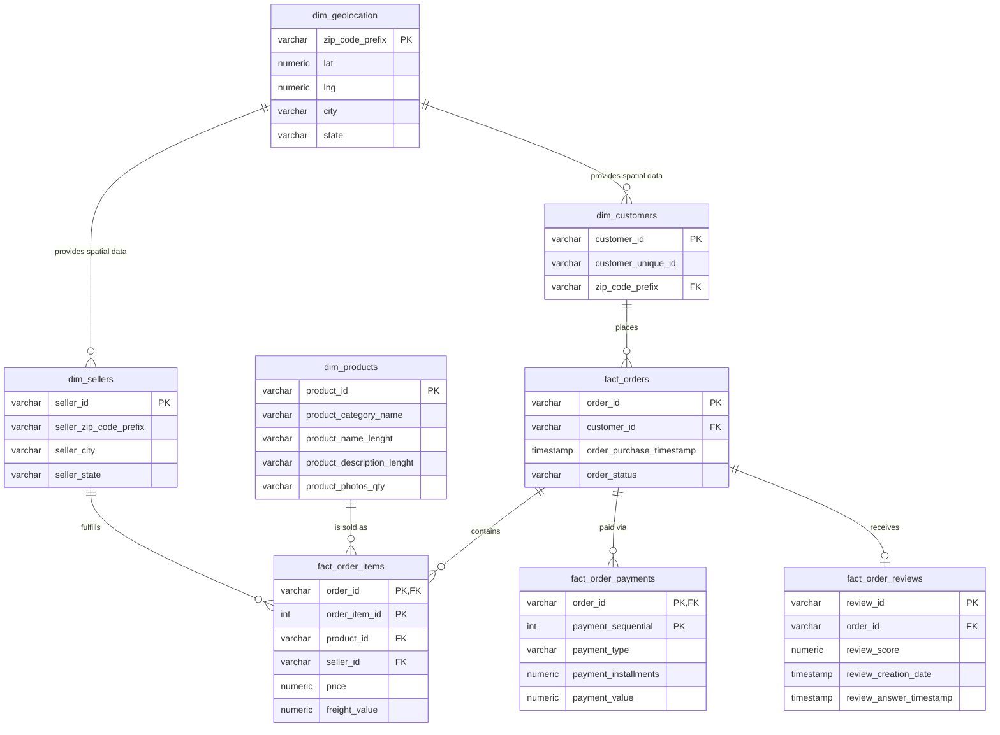

# Brazilian E-Commerce Analytics & Relational Database Pipeline

## 📌 Project Overview

This project analyzes the Olist Brazilian E-Commerce Dataset, which contains approximately 100,000 orders from 2016 to 2018. The goal is to build a complete end-to-end data pipeline that covers raw data ingestion, transformation, and analytics-ready schema design.

The repository demonstrates how raw transactional e-commerce data can be transformed into a structured, reliable, and analytics-ready relational database using SQL best practices. It focuses on:

- Data ingestion from raw CSV files
- Data cleaning and validation
- 3NF relational database design
- Business intelligence queries
- SQL performance optimization
- Analytical exploration of e-commerce trends

This project is designed to showcase strong SQL, database modeling, and data engineering fundamentals for recruiters and hiring managers.

---

## 🛠️ Tech Stack

| Component | Technology |
|-----------|-----------|
| Database | PostgreSQL / SQL-compatible RDBMS |
| Data Format | CSV files |
| Query Language | SQL |
| Data Modeling | 3NF Normalization |
| Analytics | CTEs, Window Functions, Aggregations |
| Optimization | Indexing, Query Tuning, EXPLAIN ANALYZE |
| Tools | Git, SQL Editor, DB Client |
| Data Source | Olist Brazilian E-Commerce Dataset |

---

## ✨ Key Features

- End-to-end SQL data pipeline from raw data to analytics-ready schema
- Structured 3NF database design for referential integrity
- Staging layer for raw ingestion
- Data cleaning and deduplication logic
- Business-focused analytical queries
- Advanced SQL techniques like:
  - Common Table Expressions (CTEs)
  - Window functions
  - Recursive queries
  - Aggregate analysis
- Performance-oriented SQL practices and optimization

---

## 🗄️ Database Architecture (3NF Schema)

The raw dataset was normalized into a Third Normal Form (3NF) relational schema to reduce data redundancy, ensure referential integrity, and support meaningful analytics.



### Schema Design Highlights

- Customers and sellers are separated into dimension tables
- Products are stored independently for reusability
- Orders remain the central transaction fact table
- Order items, payments, and reviews are linked to order-level facts
- Geography data is centralized in `dim_geolocation`
- The schema is normalized to reduce duplicate information and support clean analytical querying

---

## 📁 Project Structure

```text
E-Commerce-Analytics/
├── Data/                              # Raw data files (ignored in git)
├── docs/
│   └── data_quality_report.md         # Profiling and quality analysis
├── SQL_Scripts/
│   ├── 01_DDL_and_Data_Load.sql       # Creates staging tables and loads raw data
│   ├── 02_Data_Cleaning_and_Load.sql  # Cleans and normalizes data into 3NF tables
│   ├── 03_Subqueries_and_CTEs.sql     # Advanced analytical SQL
│   ├── 04_Window_Functions.sql        # Window-based business analytics
│   └── 05_Optimization.sql            # Indexes, tuning, performance analysis
├── .gitignore
├── README.md
└── LICENSE
```

---

## 🚀 Getting Started

### Step 1: Clone the Repository

Clone the project to get the complete structure, including the `Data/`, `docs/`, and `SQL_Scripts/` folders.

```bash
git clone https://github.com/your-username/E-Commerce-Analytics.git
cd E-Commerce-Analytics
```

### Step 2: Download the [Raw Dataset](https://www.kaggle.com/datasets/olistbr/brazilian-ecommerce) from Kaggle
 -  Make sure all CSV files are extracted into the `Data/` folder before proceeding
### Step 3: Create the Database in PostgreSQL
``` bash
psql -U postgres -d postgres -c "CREATE DATABASE ecommerce_analytics;"
```
### Step 4: Run the Two Core Pipeline Scripts
- Script 1: Create Staging Tables and Load Raw Data
``` bash
psql -U postgres -d ecommerce_analytics -f SQL_Scripts/01_DDL_and_Data_Load.sql
```
- Script 2: Clean, Deduplicate, and Populate the 3NF Schema
``` bash
  psql -U postgres -d ecommerce_analytics -f SQL_Scripts/02_Data_Cleaning_and_Load.sql
```


